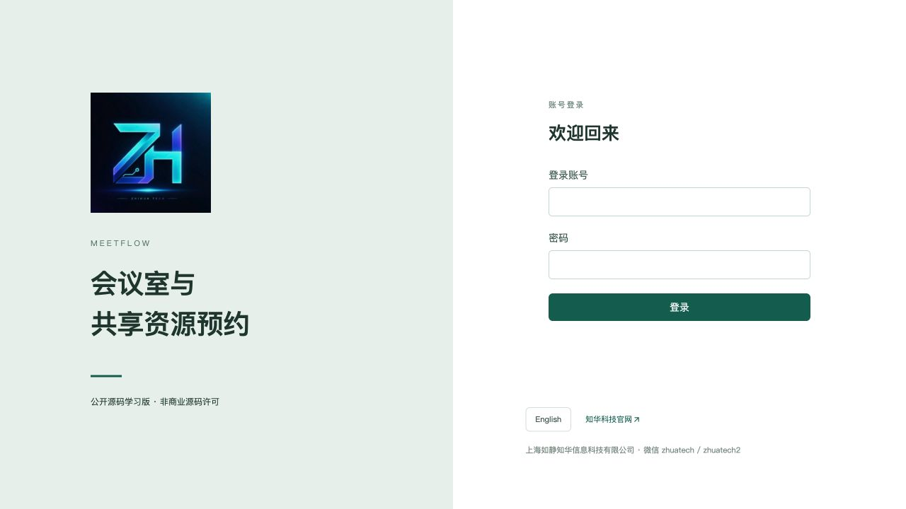
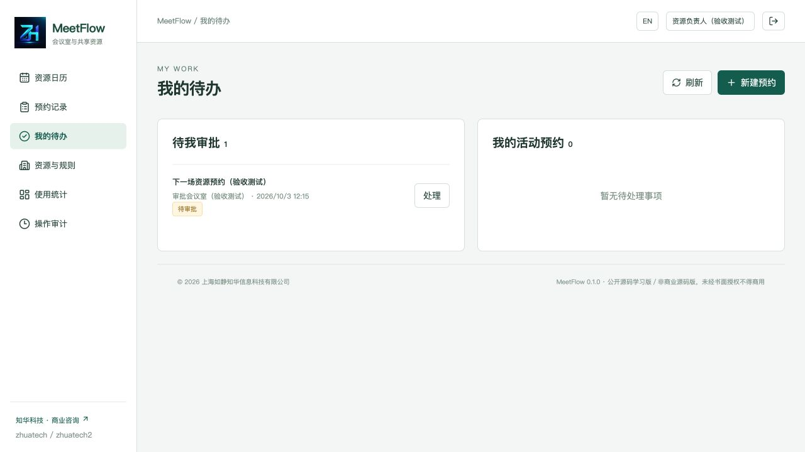
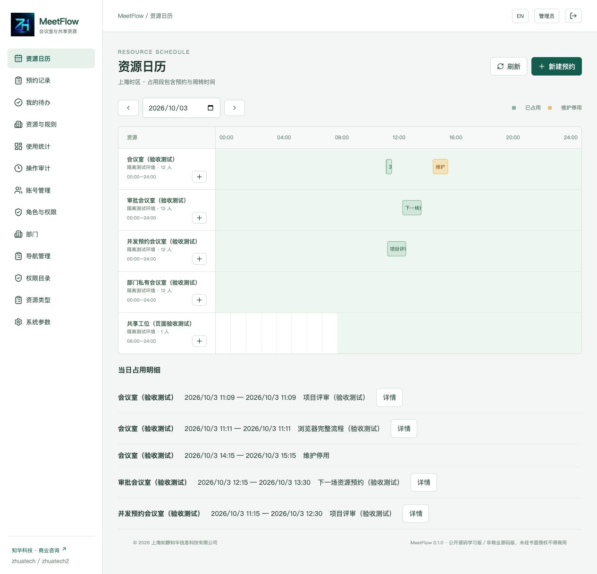
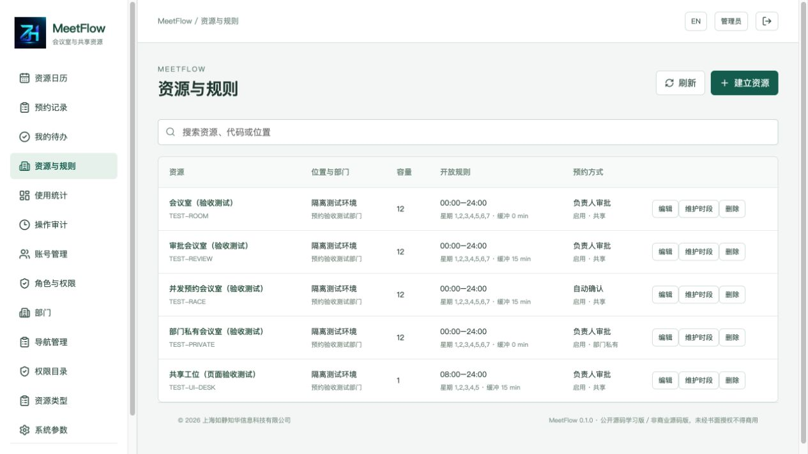
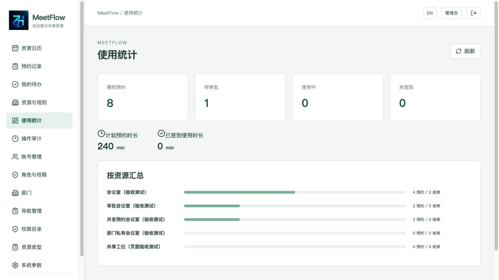
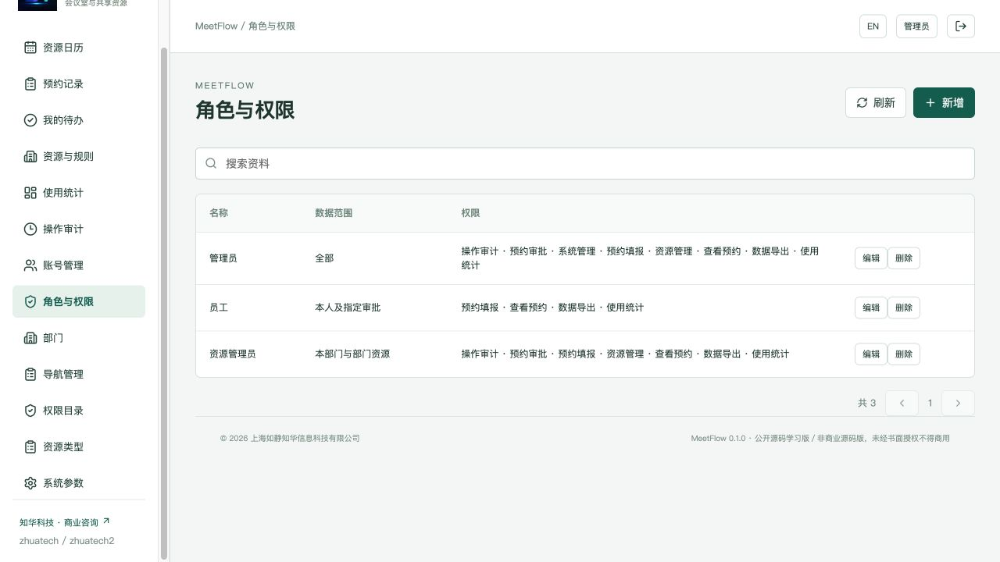
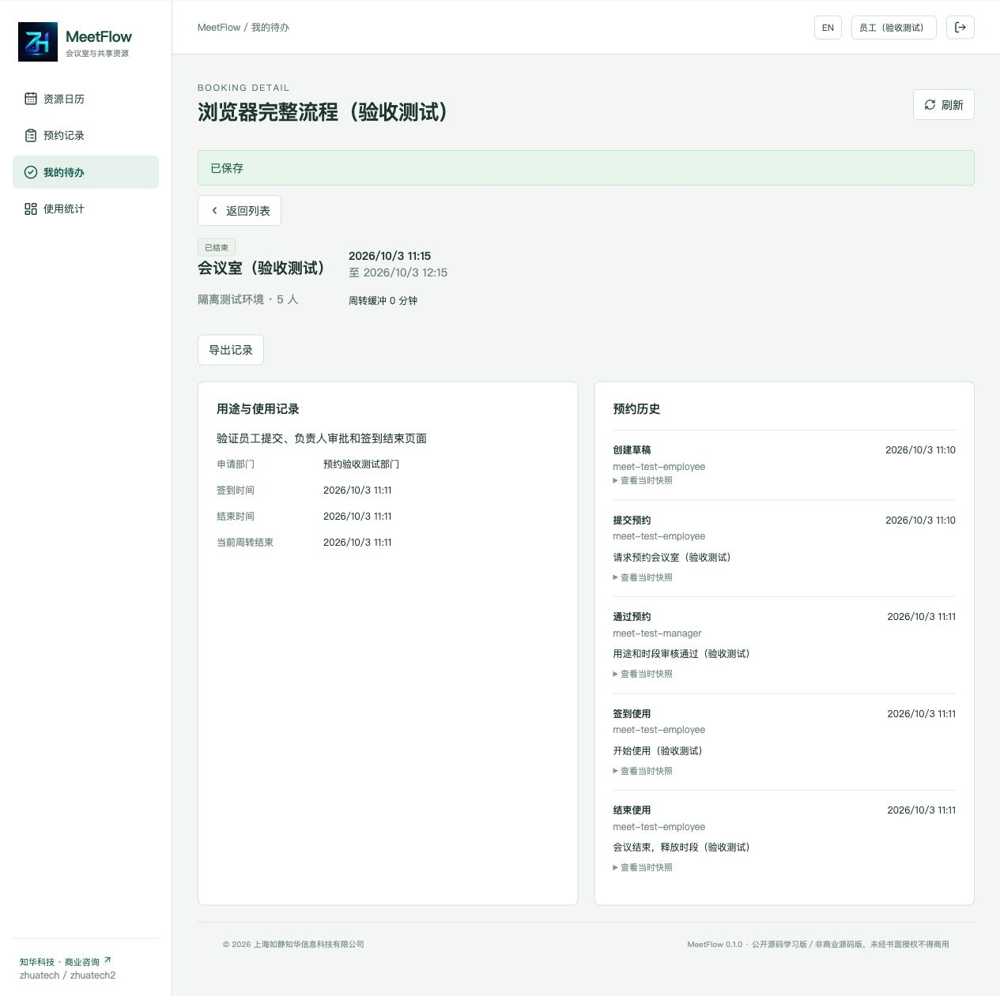
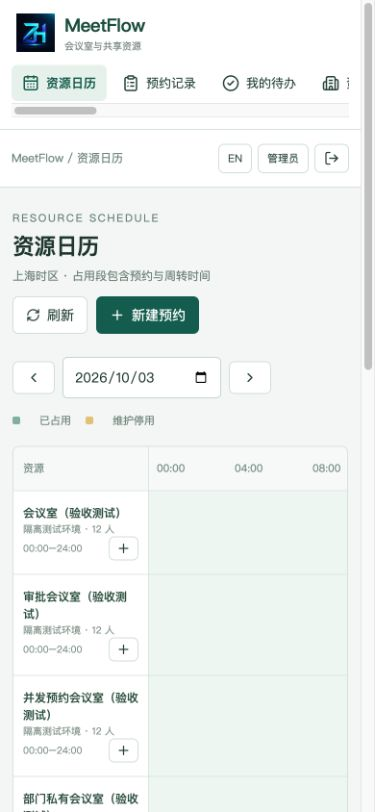

[中文](README.md) | [English](README.en.md)


# ZhiHua MeetFlow · Enterprise Meeting Room and Shared Resource Booking

**ZhiHua Technology (Shanghai Rujing Zhihua Information Technology Co., Ltd.)** · [Official website](https://www.zhuatech.cn/).

Version 0.1.0 is a Java 21 / Spring Boot / Vue 3 / MySQL learning edition connecting availability rules, requests, designated approval, check-in, usage completion and maintenance for meeting rooms, desks and individually shared equipment. Chinese/English responsive views serve employees, resource stewards and administrators.

**Source available for individual learning, technical research and non-commercial exchange.** Commercial use, paid deployment, client delivery, SaaS and resale require prior written company authorization under the existing [LICENSE](LICENSE). This is not an OSI-approved open-source license. Third-party components retain their own terms; software is provided as-is.

## Scenarios, roles and implemented operations

For organizations studying private shared-resource scheduling, concurrent reservations and department permissions. The application runs independently of inventory, procurement, expenses or CRM; approved customization may integrate separate systems.

| Actor | Implemented operations |
| --- | --- |
| Employee | Visible-resource calendar, own drafts, submission/cancellation, check-in/early finish and authorized JSON export |
| Resource manager | Department rules, designated approvals, department bookings/maintenance, statistics and audit |
| Administrator | Full-scope resources/bookings; accounts/roles/departments, navigation, registered permissions, resource dictionaries and settings |

- Calendar uses Asia/Shanghai day boundaries, showing maintenance and occupancy. Unauthorized bookings only appear as busy, without IDs, titles, applicants or status.
- Rules cover room/desk/shared-equipment type, department-private/shared access, capacity, weekdays/opening time, notice, maximum duration, turnaround buffer and check-in grace.
- Draft/rejected requests are editable. Submission rechecks rules/conflicts. Lists support search/status/resource/own filters, sorting and database pagination.
- The submitted resource steward approves/rejects independently; applicants cannot approve themselves, and administrators cannot substitute their identity. Pending approval reserves its time.
- Check-in opens fifteen minutes early, checking actual early occupancy too. Early completion releases capacity after its frozen buffer.
- Pending requests expire at planned start; confirmed bookings become no-show at grace expiry; in-use bookings complete at planned end. The processor runs every sixty seconds, and writes clean expired occupancy on that resource first.
- Maintenance shares the resource lock, cannot cover effective reservations, and retains cancellation history.
- Scoped statistics show states, planned/actual minutes and resource counts. Events and submitted snapshots cannot be edited through the API.
- Account enable/disable, password reset, ALL/DEPARTMENT/ASSIGNED scopes and designated approval are checked by the server.

Not implemented: recurring/cross-day meetings, waitlists, quantity inventory, access-control hardware, email/SMS reminders, approval delegates or multistage approval, attachments, Outlook/Google Calendar, SSO, tenant isolation or AI. No demo/simulated third-party interface exists. Core local operations require no external API key.

## Actual running screens

Existing screenshots show actual isolated-test operations. Records labelled acceptance/test are absent from normal initialization, without real customer examples or passwords.

| Login | Own work and designated approvals |
| --- | --- |
|  |  |
| Resource availability/maintenance | Resource rules |
|  |  |
| Authorized usage totals | Roles and permissions |
|  |  |
| Booking state and event snapshots | Mobile operating layout |
|  |  |

## Time and state

Starts/ends use fifteen-minute boundaries within one Shanghai calendar day, within capacity, opening/notice/duration rules. End plus buffer cannot exceed closing time. Drafts hold no capacity; pending, confirmed, in-use and remaining completed buffers do. Half-open intervals allow exact end-plus-buffer adjacency. Resubmission uses current rules; later rule changes do not rewrite submitted snapshots.

`DRAFT → PENDING → CONFIRMED → IN_USE → COMPLETED`; automatic-confirmation resources skip PENDING. Rejected drafts can be edited/resubmitted. PENDING reaches EXPIRED at start; unclaimed CONFIRMED reaches NO_SHOW at grace/end. Eligible pre-use records can cancel. Only never-submitted own drafts can be physically deleted; submitted history remains.

Check-in is before grace deadline and planned end, at most fifteen minutes before start. Its early occupied interval must not collide with previous use or maintenance. Only the applicant finishes in-use work early, or scheduled processing finishes at end. Planned instants remain; actual check-in/finish are separate. No-show contributes no actual usage minutes.

## Requirements, architecture and directories

Java **21**, Maven **3.9**, Spring Boot **4.0.7**, Spring Security/JPA/Flyway; MySQL **8.4**, MariaDB JDBC **3.5.10**; Node.js **24.19.0**, Vue **3.5.40**, Vite **8.1.5**, Lucide **1.48.0**; Docker Engine/Desktop, Compose v2 and non-root application/Nginx containers. Python 3 handles initialization/acceptance checks.

Vue → same-origin Nginx `/api` → Spring Boot → MySQL. HttpOnly sessions/CSRF protect requests, UTC instants persist while Shanghai governs rules/display. Flyway V1/V2 migrate schema; JPA validates it.

```text
backend/src/main/java/cn/zhuatech/meetflow/  Bookings, authorization, maintenance and administration
backend/src/main/resources/db/migration/  V1 identity and V2 booking SQL
backend/src/test/                          Business boundaries and HTTP integration
frontend/src/                             Bilingual UI, time and action rules
frontend/public/brand/                   Official logo
frontend/public/third-party/             Frontend licenses
scripts/                                  Private initialization, acceptance and release checks
docs/                                     Operation, API, architecture, deployment, security and screenshots
compose.yaml                              Three services and persistent MySQL volume
```

Tables include `meeting_resource`, `meeting_booking`, `resource_block`, `booking_event`, `booking_command` and identity/role/permission/department/navigation/settings/audit. Foreign keys protect referenced history; migrations define indexes and constraints. See [architecture](docs/architecture.md).

READ_COMMITTED writes lock a resource, refresh its booking, process due transitions and validate live authorization/rules/version/interval before atomically writing record/command/event/audit. All occupancy and maintenance operations share this lock order; different resources may proceed independently. Same-actor successful-key retries require identical action/payload and still recheck permission; changed content cannot reuse a key.

## Installation and database initialization

Docker includes Java/Node; use Compose v2, Python 3, official dependency access and an unused local port. From a fresh checkout:

```sh
git clone https://github.com/zhuatech-han/zhuatech-meetflow.git
cd zhuatech-meetflow
python3 scripts/init-env.py
docker compose -p meetflow config --quiet
docker compose -p meetflow up -d --build --wait
```

Open `http://127.0.0.1:8102/`; health is `/actuator/health` through the same entry. First username is `admin`, with independent random `ADMIN_PASSWORD` in private `.env`. The generator creates three secrets, mode 0600, without displaying or overwriting existing settings. No universal password exists. Existing/restored accounts are not reset by new initialization variables.

Empty-database startup seeds main department, administrator/employee/resource-manager roles, eight permissions, thirteen navigation entries, three resource types, Shanghai timezone and ninety-day window. It creates no resources, bookings or fictional customer records. First create employee/steward accounts, then resources/rules and employee drafts.

| Configuration | Meaning/default |
| --- | --- |
| `DATABASE_PASSWORD` | Required independent application-database secret |
| `MYSQL_ROOT_PASSWORD` | Required MySQL administration secret |
| `ADMIN_PASSWORD` | Initial account only; minimum twelve upper/lowercase/digit characters, maximum seventy-two UTF-8 bytes |
| `WEB_PORT` / `BIND_ADDRESS` | 8102 / 127.0.0.1 |
| `COOKIE_SECURE` | false for local HTTP; true for trusted HTTPS |

MySQL/backend have no host port mappings. For conflict choose another private WEB_PORT, leaving other projects running. Stop with `docker compose -p meetflow down` to retain data; `down -v` deletes that project's database and is only for explicitly disposable tests.

### Separate development

Use independent MySQL 8.4 and inject `DATABASE_URL`, `DATABASE_USER`, `DATABASE_PASSWORD`, matching `DATABASE_CATALOG` and `ADMIN_PASSWORD` safely. Compose mysql is not a host-reachable endpoint, and `.env` is not automatically loaded into Java. These connection overrides are direct-running settings; adapting Compose requires corresponding environment mapping.

```sh
mvn -f backend/pom.xml spotless:check test spring-boot:run
cd frontend
npm ci
npm run dev
```

Vite `http://127.0.0.1:5173/` proxies `/api` and health to host backend 8080. Passwords never enter frontend configuration. See [deployment](docs/deployment.md).

## Tests and independent acceptance

```sh
mvn -B -f backend/pom.xml spotless:check test package
cd frontend
npm ci
npm run format:check
npm run lint
npm test
npm run build
cd ..
docker compose -p meetflow-check config --quiet
docker compose -p meetflow-check build
docker compose -p meetflow-check up -d --wait
python3 scripts/release-check.py
git diff --check
```

Backend/frontend tests cover scopes, independent approval, half-open intervals, rules/buffers/maintenance, expiry/no-show/automatic finish, contention/idempotency/versions, time conversions, actions, CSRF and expired sessions. H2 integration does not replace real MySQL; Docker Maven builds execute tests without skipping them.

Only on a fresh explicitly disposable test project, with that checkout's matching private `.env`:

```sh
python3 scripts/smoke.py --base http://127.0.0.1:8102 --run
python3 scripts/smoke.py --base http://127.0.0.1:8102 --verify
```

The script restricts loopback, creates labelled test users/bookings and stores private mode-0600 `.smoke-state.json`. Use independent settings/state when other QA work exists. It exercises complete booking, stale-version rejection, identical-key retry, concurrent single winner, calendar privacy, department isolation, maintenance and export. `--verify` checks retained completed state/events and maintenance; pending may legitimately expire with time. Verify original role accounts and actual browser desktop/mobile operation, restart/migration and independent fresh-volume restore before release. Tests are not load, penetration or production reliability certification.

## Deployment, backups and limits

Use trusted HTTPS, secure cookies, least privilege, controlled gateway, monitoring and private backups. The supplied local Nginx uses its own HTTP scheme; external TLS termination needs correct trusted-proxy scheme handling. Do not trust arbitrary client forwarding headers. External MySQL needs trusted certificate validation, not the isolated-local defaults. See [deployment](docs/deployment.md).

Before upgrade stop writes, record old code/image and safely store configuration. Consistently dump MySQL to private restricted storage outside Git; backups include business/account data. Restore into another project, unused port and fresh MySQL volume before starting application services; verify migration history, original passwords/scopes and booking/events/maintenance. Add higher-version SQL without modifying applied V1/V2. Do not hide mismatch with Flyway repair; validate backup and compatible application/database rollback first.

Single backend/MySQL and single-instance scheduling target a small private deployment. Catalogs cap at 10,000 records; booking lists use database pagination and statistics reject over 10,000 rather than silently hiding records. No distributed scheduling, high availability, multi-tenant or production load guarantee exists. Automatic state processing can take up to a minute and must not be bypassed by manual clock/state edits.

## Troubleshooting, security and license

For initialization failure check strong matching secrets, service health and migration diagnostics without deleting business volumes. No available steward means an enabled department/ALL account needs resource-management and approval rights. Conflicts may be pending/confirmed/in-use bookings, completed buffers or maintenance. Effective reservations prevent incompatible rule/steward changes; resolve existing bookings deliberately. On stale versions refresh detail rather than replaying changed content with an old key. Password variables only seed an empty database, not existing accounts.

BCrypt 12, thirty-minute HttpOnly/SameSite Strict sessions, CSRF, same-origin policy, login limiting, live disable/password invalidation, parameter binding and historical references are implemented. Hidden navigation never grants/denies an API. Busy-only calendars conceal unauthorized identifiers, purpose and people. JSON export contains only scoped business records, without credentials or promotion. See [security](docs/security.md), [operations](docs/operations.md) and [API](docs/api.md).

Issues/contributions should describe business reason, safe reproduction and verified small changes without actual bookings, client records, secrets or private logs. Preserve attribution, the existing LICENSE and original [Vue](docs/licenses/vue.txt)/[Lucide](docs/licenses/lucide.txt) notices. Third-party rights are independent. Report security privately rather than exposing sensitive exploit details. Deployment suitability, data protection and commercial delivery are operator responsibilities and written agreements, without universal organizational guarantees.

## Contact ZhiHua Technology

**ZhiHua Technology (Shanghai Rujing Zhihua Information Technology Co., Ltd.)**. Commercial authorization, customization, deployment and system integration:

- Website: [https://www.zhuatech.cn/](https://www.zhuatech.cn/)
- Email: [han@zhuatech.cn](mailto:han@zhuatech.cn)
- Email: [jack@zhuatech.cn](mailto:jack@zhuatech.cn)
- WhatsApp: [+86 17521234993](https://wa.me/8617521234993)
