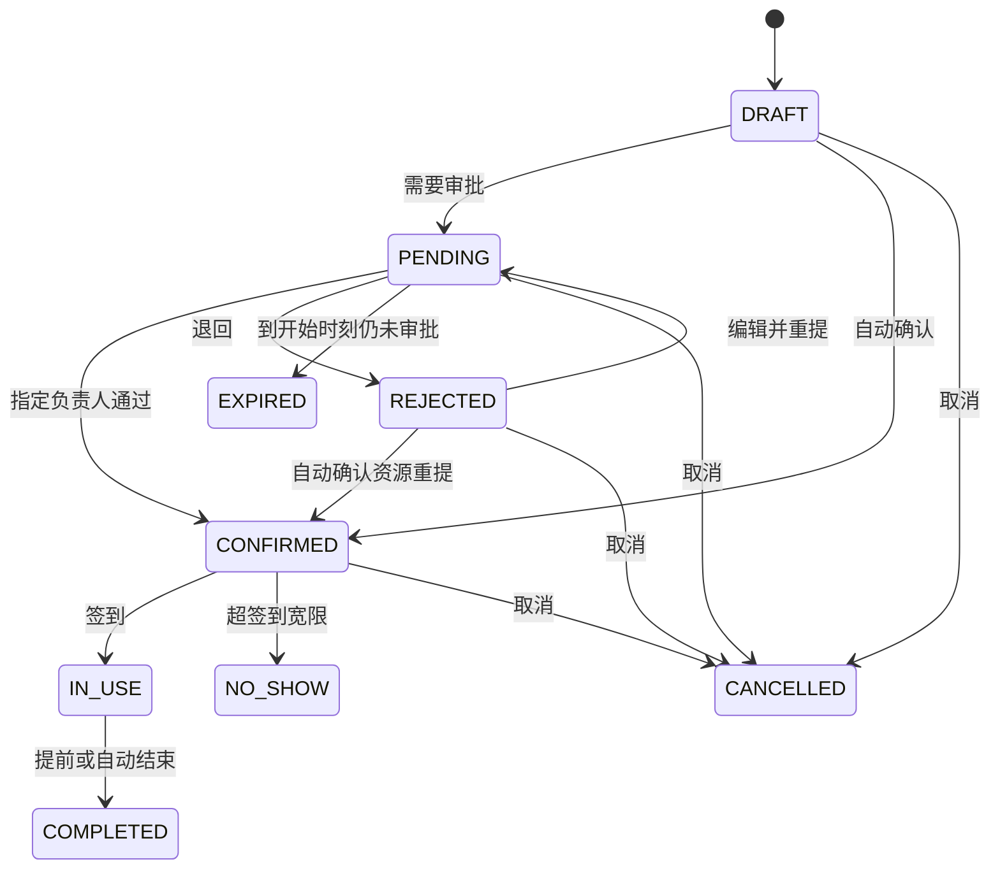

<div align="center">


# MeetFlow · 企业会议室与共享资源预约

**公开源码学习版／非商业源码版**

知华科技（上海如静知华信息科技有限公司） · [官网](https://www.zhuatech.cn/)

[操作手册](docs/operations.md) · [部署](docs/deployment.md) · [接口](docs/api.md) · [架构](docs/architecture.md) · [安全](docs/security.md)
</div>

## 共享资源，从预约到归还

会议室、共享工位和共享设备常在多个部门之间流转。MeetFlow 面向资源负责人、普通员工和系统管理员，把时段规则、审批、签到、结束使用和维护停用放在同一条可追溯流程中。员工先看到是否可用，负责人根据实际用途审批，系统保留每次状态变化和使用时长。

本版本独立运行，不依赖进销存、采购、报销或客户系统。它适合研究企业资源预约、并发冲突和部门权限，也可用于经书面授权的进一步定制。

| 参与者 | 可操作内容 |
| --- | --- |
| 员工 | 可见资源日历、本人草稿、提交、取消、签到、提前结束、授权 JSON 单据导出 |
| 资源管理员 | 部门资源规则、指定审批待办、部门预约与维护、部门统计及审计 |
| 系统管理员 | 全范围资源和预约；账号、角色、部门、导航、权限目录、资源类型、参数管理 |

### 已实现的模块

- **资源日历**：按上海时区查看单日占用和维护，其他人的无权预约只显示“已占用”。
- **资源与规则**：会议室／共享工位／共享设备类型，部门私有或跨部门共享，人数、开放星期与时间、提前量、最长时长、周转缓冲、签到宽限。
- **预约记录**：草稿和退回可编辑；提交时再次检查规则和冲突；搜索、状态及资源筛选、本人筛选、排序、数据库分页。
- **审批与待办**：固定资源负责人审批，申请人不得审批自己的预约；审批中也保留时段。
- **签到与结束**：开始前15分钟可签到，实际提前占用也校验冲突；提前结束后按快照中的缓冲分钟释放。
- **异常处理**：待审批预约到开始时间自动过期；确认预约超签到宽限自动标为未签到；使用中预约到计划结束自动结束。
- **维护停用**：维护与预约共用资源锁，不能覆盖有效预约；取消维护保留历史。
- **统计与审计**：授权预约状态数、计划及实际使用分钟、资源预约数量、不可修改的事件与提交快照。
- **身份管理**：账号启停、密码重置、角色权限、全范围／部门／本人和指定审批范围；中文及英文页面。

**边界**：单次预约以15分钟刻度、上海自然日为边界，人数不得超资源容量。结束时刻加缓冲不得超关闭时间。无权查看预约详情的人只能看到忙闲信息。自动处理周期为60秒，写入前也会清理本资源的过期占用。

**尚未实现**：循环预约、跨日会议、候补排队、设备数量库存、门禁硬件、邮件／短信提醒、审批代理、多人分级审批、附件、Outlook／Google Calendar 同步、SSO、租户隔离、AI。没有演示模式或第三方模拟接口。当前所有功能均为本地真实业务，无需第三方 API 配置。

## 页面

截图来自隔离测试库的实际运行页面，带“验收测试”的记录不随系统初始化安装。

| 登录 | 我的待办 |
| --- | --- |
|  |  |

| 资源日历 | 资源管理 |
| --- | --- |
|  |  |

| 使用统计 | 角色权限 |
| --- | --- |
|  |  |

## 时间和状态如何衔接



草稿不占时段，待审批、已确认、使用中及结束后的缓冲占时段。区间为左闭右开：上一段结束加缓冲等于下一段开始时可以相接。重提按当前资源规则重新检查。已提交的记录只能取消，不能物理删除；仅从未提交的本人草稿可删除。

## 工程与数据

浏览器通过 Nginx 同源访问 Vue 页面与 Spring Boot API，业务写入 MySQL。Flyway 负责结构迁移，JPA 只校验结构。会话放在 HttpOnly Cookie 中，写操作携带 CSRF 令牌；资源行锁串行化同一资源上的预约和维护，版本号防止旧页面覆盖新记录，请求键处理同内容重试。

| 层 | 固定版本／配置 |
| --- | --- |
| 后端 | Java 21、Spring Boot 4.0.7、Maven 3.9、Spring Security、JPA、Flyway |
| 数据库 | MySQL 8.4，MariaDB JDBC 3.5.10 连接 MySQL，统一 UTC 存储 |
| 前端 | Vue 3.5.40、Vite 8.1.5、Node 24.19.0、Lucide 1.48.0 |
| 校验 | Spotless 2.43.0／Google Java Format、ESLint 10.11.0、Prettier 3.9.9、JUnit、Node test |
| 部署 | Docker Compose v2，非 root 后端与 Nginx；默认仅回环地址暴露8102 |

```text
backend/src/main/java/cn/zhuatech/meetflow/    预约、权限、维护和后台
backend/src/main/resources/db/migration/     V1身份结构、V2预约结构
backend/src/test/                            业务边界及接口测试
frontend/src/                               双语页面、时间及动作规则
frontend/public/brand/                      官方LOGO
frontend/public/third-party/                第三方前端许可
scripts/                                    独立环境初始化、验收及发布检查
docs/                                       操作、部署、架构、接口、安全、截图和许可
compose.yaml                                三服务与持久数据库卷
```

业务表为 `meeting_resource`、`meeting_booking`、`resource_block`、`booking_event`、`booking_command`。身份表包含账号、角色与权限关系、部门、导航、字典、参数和审计；外键保护被引用的历史。详见[数据及并发设计](docs/architecture.md)。

空库只初始化总部、管理员／员工／资源管理员角色、8项权限、13项导航、3种资源类型、上海时区和90天预约窗口。**不初始化业务资源、预约或虚构客户数据。** 默认账号为 `admin`；密码来自私有 `.env` 中的 `ADMIN_PASSWORD`，无固定通用密码。已有数据库重启不会重新写入管理员或修改其密码。

## 启动

### Docker Compose（推荐）

需要 Docker Engine 或 Docker Desktop、Compose v2、Python 3、可访问官方依赖仓库的网络，以及未占用的本地端口。首次镜像构建包含全部测试，需预留构建内存和时间。

```bash
git clone https://github.com/zhuatech-han/zhuatech-meetflow.git
cd zhuatech-meetflow
python3 scripts/init-env.py
docker compose -p meetflow up -d --build --wait
```

打开 <http://127.0.0.1:8102>。只在本机打开 `.env` 查阅初始密码，勿提交、分享截图或输出到日志。脚本生成三项独立密码，权限为0600，遇到已有 `.env` 会停止且不会覆盖。先建立员工和负责人账号，再用资源管理员建立资源，最后由员工提交预约。

| `.env` 名称 | 用途／默认 |
| --- | --- |
| DATABASE_PASSWORD | 应用数据库密码，必须提供 |
| MYSQL_ROOT_PASSWORD | 数据库维护密码，必须提供 |
| ADMIN_PASSWORD | 空库初始化管理员密码，至少12位且含大写、小写、数字，UTF-8不超过72字节 |
| WEB_PORT | 页面及同源 API 端口，8102；冲突时修改后重新启动 |
| BIND_ADDRESS | 默认127.0.0.1；对外部署须另行配置网关与 HTTPS |
| COOKIE_SECURE | 本机 HTTP 为false；HTTPS部署设true |

后端健康地址通过同源入口为 <http://127.0.0.1:8102/actuator/health>。数据库和后端未向主机暴露端口。停止保留数据：`docker compose -p meetflow down`。仅销毁明确可丢弃的测试环境时才使用 `down -v`。

### 本地开发

数据库使用独立 MySQL 8.4。后端需要 Java21和Maven3.9，前端需要Node24.19.0。设置 `DATABASE_URL`、`DATABASE_USER`、`DATABASE_PASSWORD`、`DATABASE_CATALOG` 和 `ADMIN_PASSWORD`，启动时自动迁移。`DATABASE_CATALOG` 必须与连接中的库名一致；只选专用开发库。

```bash
cd backend
mvn spotless:check test spring-boot:run
# 另一个终端在 frontend 中
npm ci
npm run dev
```

开发页面为 <http://127.0.0.1:5173>，Vite 将 `/api` 和 `/actuator/health` 代理至本机8080后端。数据库密码不由前端接收。参数配置和外部部署详见[部署文档](docs/deployment.md)。

### 数据升级与恢复

升级前停止写入，备份数据库和安全保存的环境配置；新增递增版本的 Flyway 文件，禁止修改已执行脚本。构建后启动自动执行新迁移，再检查健康、迁移历史、登录和核心预约。失败时根据日志恢复备份及旧版镜像，不执行 `flyway repair` 来掩盖结构差异。完整步骤见[部署文档](docs/deployment.md)。

## 验证与故障处理

```bash
cd backend
mvn spotless:check test package
cd ../frontend
npm ci
npm run format:check
npm run lint
npm test
npm run build
cd ..
docker compose -p meetflow-check config --quiet
docker compose -p meetflow-check build
docker compose -p meetflow-check up -d --wait
# 仅对专用、全新、可丢弃的测试库运行；会建立验收账号和预约
python3 scripts/smoke.py --run
# 重启后检查持久性
docker compose -p meetflow-check restart
python3 scripts/smoke.py --verify
python3 scripts/release-check.py
```

后端48项、前端13项测试覆盖权限、审批独立性、半开区间、开放规则、缓冲、维护、过期、爽约、自动结束、并发、幂等、版本、时间转换、页面动作、CSRF和失效会话。集成测试使用H2 MySQL模式，脚本另在真实MySQL8.4上验证业务、并发单一赢家、隐私、维护和重启持久性。桌面和窄屏页面需实际浏览器验收；测试不等于压力、渗透或生产可靠性认证。

| 现象 | 处理 |
| --- | --- |
| 初始化未启动 | 检查三项必填密码、Compose健康及后端迁移日志；密码强度不足会拒绝初始化 |
| 8102被占用 | 在私有 `.env` 更改 WEB_PORT，再执行 up |
| 无资源／无法选择负责人 | 先建立具备资源管理和审批权限的启用账号，范围为资源部门或全范围；员工角色不能作为负责人 |
| 时段冲突 | 检查待审批预约、已确认预约、使用中记录和结束后的缓冲，以及维护停用 |
| 修改规则被拒绝 | 先处理有效预约；预约历史不会被规则修改重写 |
| 页面提示记录已更新 | 刷新详情，再使用当前版本重新操作；不重复使用已改变内容的请求键 |
| 修改 `.env` 后密码不变 | 初始密码只作用于空库；已有密码由授权系统管理员在账号管理中重置 |
| 已过时但状态未更新 | 自动处理最长约一分钟；检查服务与调度日志，勿在生产中手工改时钟或状态 |

## 安全、贡献与授权

详见[安全边界](docs/security.md)。会话30分钟、BCrypt12、CSRF、登录限速、即时停用／密码变更失效、同源策略、数据库外键和参数绑定已经实现。对外运行仍需HTTPS、可靠备份、最小访问权限、监控、依赖更新和经授权的安全测试。单实例调度与单MySQL部署经过验收；没有多租户承诺。

欢迎提交包含业务原因、复现步骤和测试的变更；不要提交真实预约、客户资料、密码或环境文件。一般问题通过 [GitHub Issues](https://github.com/zhuatech-han/zhuatech-meetflow/issues) 反馈，注明版本及脱敏复现。漏洞勿在公开Issue披露，可添加咨询微信说明“安全漏洞反馈”，通过后续私密方式提供细节。

自有代码采用 [ZhuaTech Non-Commercial Source License 1.0](LICENSE)，为公开源码学习许可，并非OSI开源许可证。保留第三方版权及各自许可；[Vue](docs/licenses/vue.txt)、[Lucide](docs/licenses/lucide.txt) 及其他依赖仍按原许可使用。品牌署名不会替代或扩大许可。未经书面授权不得用于收费部署、SaaS、转售或商业交付。

免责声明：本项目用于学习和非商业交流；部署方应自行评估容量、数据保护、合规与业务适配，不保证适用于全部组织，不对未经授权的商业使用作承诺。

## 联系知华科技

本项目由知华科技（上海如静知华信息科技有限公司）提供公开源码学习版本，主要用于个人学习、技术研究与非商业交流。未经书面授权不得商用。企业信息化建设、中小企业数字化转型、中小企业 AI 转型、私有化部署、软件外包、软件项目外包、软件实施、FDE 外包、OPC 技术支持及深度定制开发，请访问知华科技官网 https://www.zhuatech.cn/，或添加微信 zhuatech、zhuatech2 咨询。

| 商业授权／部署与系统集成 | 商业授权／定制开发 |
| --- | --- |
| 微信 **zhuatech** | 微信 **zhuatech2** |
|  |  |
